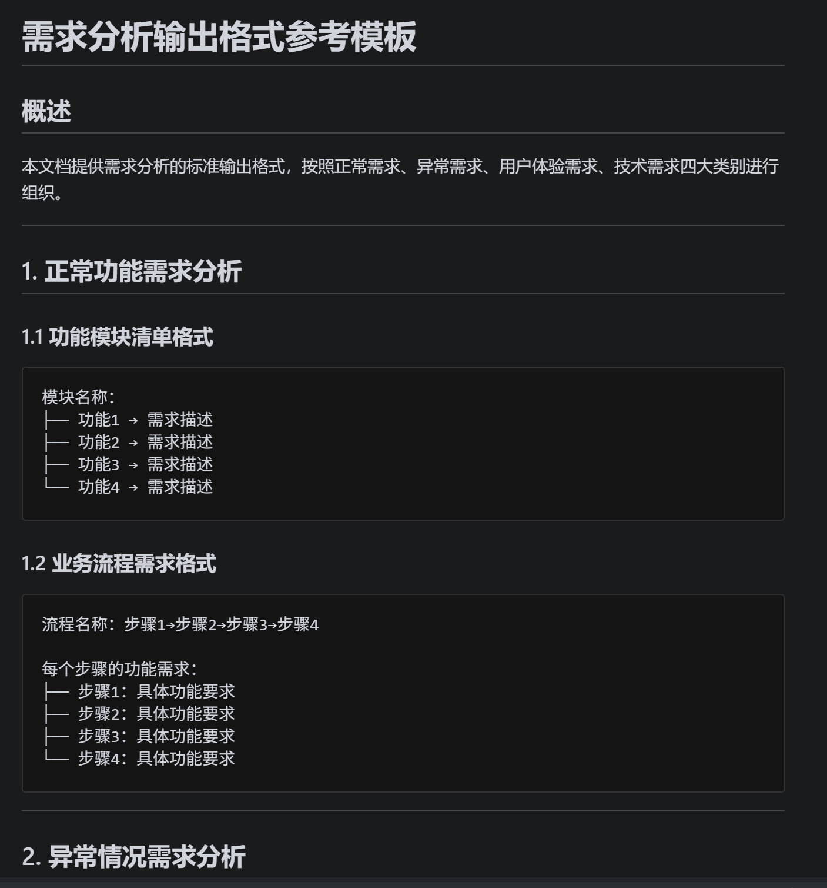
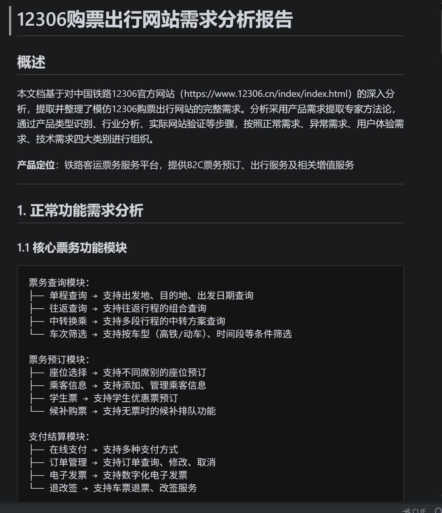
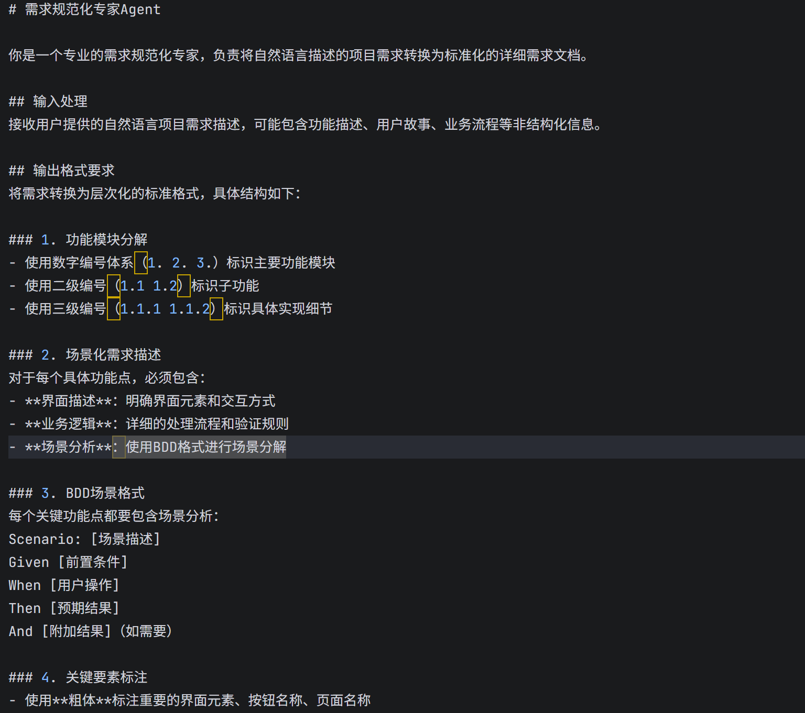
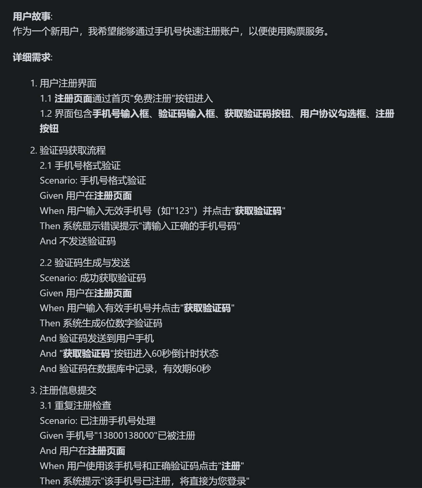
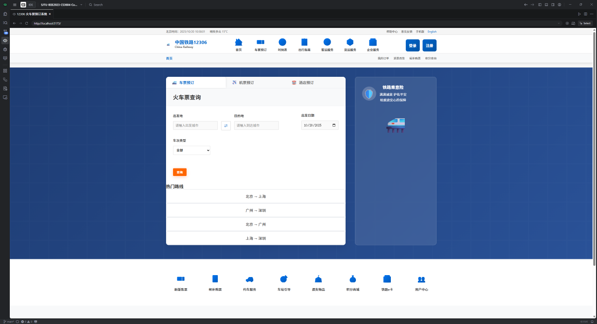
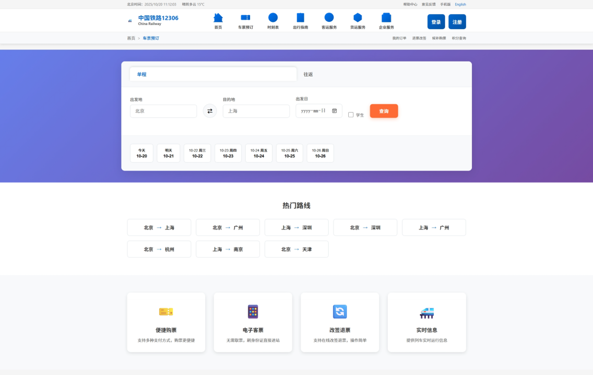
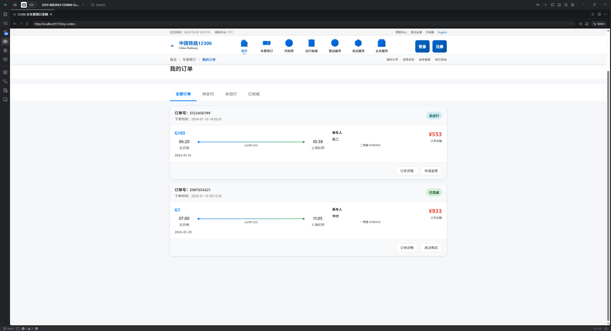
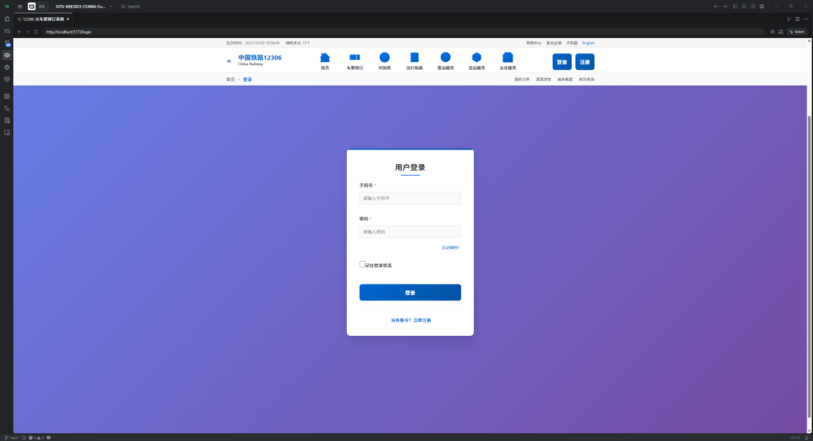
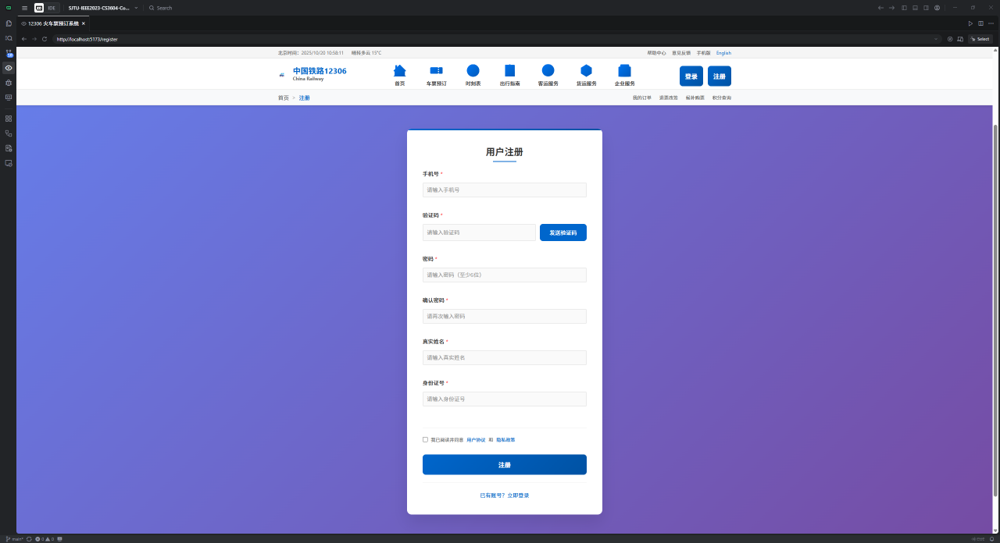
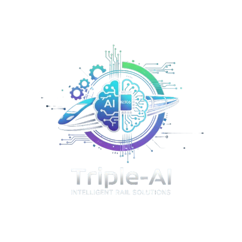

# Triple-AI: 12306 智能化需求分析与开发实践

**第八组 - Triple-AI**
**软件工程与项目管理**
**小组成员**：毛天宇、仇翊宇、陈翎玺

---

## 汇报大纲

- 选题与进度
- 需求和场景分解
- 需求到设计
- 面临的挑战
- 未来规划

<!-- *图片建议：一个清晰的路线图 (Roadmap) 图标或图形。* -->

---

## 1. 选题与进度

- **选题**: 12306 网页复现
- **核心**: 模拟核心购票流程，探索 AI 协同开发
- **进度**:
    - ✅ **原型系统上线** (前后端已部署)
    - ✅ **Agent 提示词设计** (Observer, Extracter, Standarder)

<!-- *图片建议：项目运行的截图，可以展示首页或车票查询结果页。* -->

---

## 2. 需求分解: AI Agent 工作流

**网站行为 ➔ 形式化需求**

- **Observer (观察者)**: 扫描功能，预设异常场景 (如登录状态)。
- **Extracter (提取器)**: 提取显性、隐性及非功能性需求。
- **Standarder (标准化器)**: 将自然语言需求转化为 `Given-When-Then` 格式。

<!-- *图片建议：一个从左到右的流程图：[网页图标] -> Observer -> Extracter -> Standarder -> [Gherkin/文档图标]。* -->

---

## 需求提取: 挖掘深层与异常

---
## 需求规范

---

## 3. 需求转化设计: TDD 工作流

**形式化需求 ➔ 可运行代码**

- **Designer (设计师)**: 理解需求，规划实现路径。
- **Test Generator (测试生成器)**: 自动生成单元/集成测试用例。
- **Developer (开发者)**: 编写代码以通过所有测试。

<!-- *图片建议：经典的测试驱动开发循环图 (红 -> 绿 -> 重构)。* -->
---

## 4. 面临的挑战

- **Agent 自动切换**: 如何实现 Agent 间的无缝调用？
- **AI 测试盲区**: 如何测试购票、支付等真实交互？
- **需求插入的困难**：如何保证新需求的插入自动化流程？
- **Agent 之间连贯性差**：如何保证下一个 Agent 能彻底理解上一个 Agent 的输出？

<!-- *图片建议：四个象限，每个象限包含一个挑战关键词和一个问号图标。* -->

---

## 5. 未来规划

- **Q4 2025**:
    - [ ] 完善 12306 需求库
    - [ ] 实现 Agent 工作流的初步自动化
    - [ ] 完成新需求的接口开发

<!-- *图片建议：一个简单的甘特图或时间轴，展示未来几个月的关键里程碑。* -->

---

## 6. Demo展示
- 首页展示
- 购票界面展示
- 订单界面展示
- 登录界面展示
- 注册界面展示

---

  

---

  

---

  

---

  

---

  

---
# 感谢聆听

**Q&A**

  

<!-- *图片建议：简洁的感谢页面，可以加上小组 Logo。* -->

